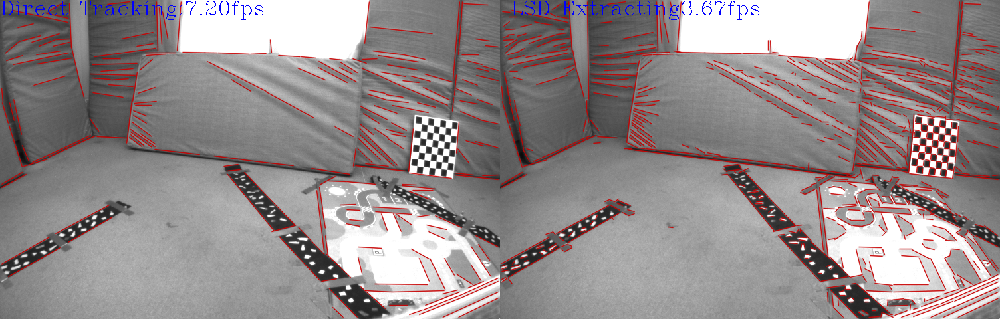

# d-stvo

This project makes improvements based on [StVO-PL](https://github.com/rubengooj/stvo-pl). The main improvement lies in the segment tracking part. We design a new semi direct line tracking algorithm, It consists of four steps: sampling, tracing, fitting, and refinement of line segments. In order to adapt to the visual odometry algorithm, we also propose a key frame management mechanism. Feature line segments are extracted and matched for key frames, and line segments are tracked directly for ordinary frames.

Through the improvement of appeal,  the proposed algorithm is 2.5 times faster than the original algorithm. The operation of the proposed algorithm and the traditional algorithm is shown in the figure below. On the left is the proposed algorithm, and on the right is the traditional algorithm.



  # installation

  Follow the [StVO-PL](https://github.com/rubengooj/stvo-pl/blob/master/README.md) installation instructions

  # Usage

```sh
export DATASETS_DIR=/mnt/hgfs/dataset/KITTI/data_odometry_gray/
cd build
./imagesStVO 00 -c ../config/config/config_kitti.yaml -o 100 -s 1 -n 1000
```


